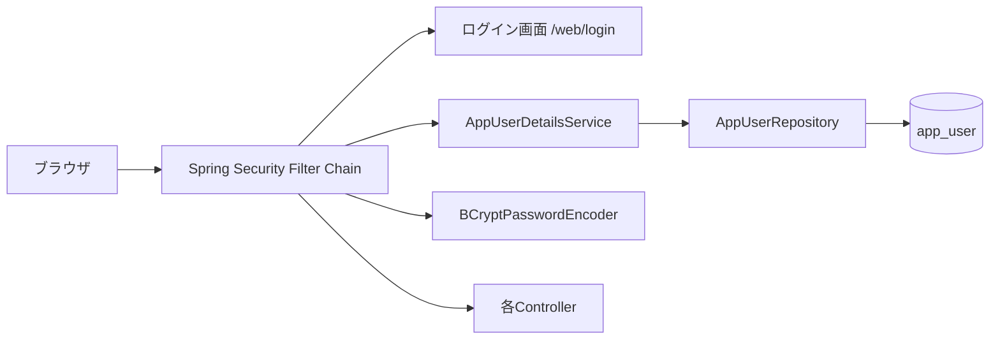
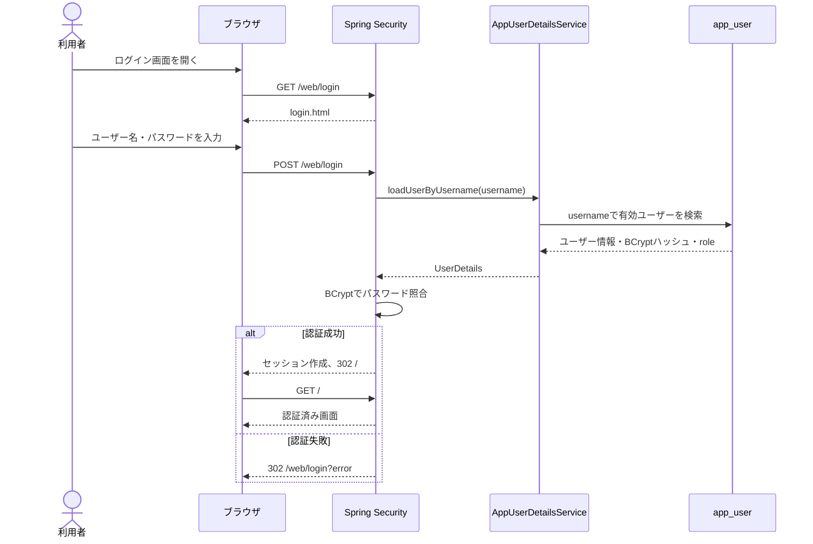

# 認証・認可設計書

## 1. 目的

本書は、LessonApplication の認証・認可方式、ユーザー情報の管理方法、画面/APIへのアクセス制御、およびセキュリティ上の前提を定義する。

対象実装:

- Spring Boot 4.1.1
- Spring Security（`spring-boot-starter-security`）
- Spring Data JPA
- Thymeleaf
- H2 / PostgreSQL

## 2. 基本方針

- 認証方式は、Spring Security のフォームログインを使用する。
- Web画面はCookieによるセッション認証、APIはBearer Token認証とする。
- Web画面は`/web/**`、APIは`/api/**`を公開境界とする。
- 認証情報のユーザー名・パスワードは `app_user` テーブルで管理する。
- パスワードは平文で保存せず、`BCryptPasswordEncoder` でハッシュ化する。
- アプリケーションの通常画面は、認証済みユーザーだけが利用できる。
- データの登録・更新・削除など管理操作は、`ADMIN` ロールを持つユーザーに限定する。
- 認証ユーザーの削除は物理削除ではなく、`delete_datetime` による論理削除とする。

## 3. 構成



| コンポーネント | 責務 |
|---|---|
| `SecurityConfig` | URL単位の認証・認可、ログイン、ログアウト、CSRF、フレーム制御を設定する |
| `AuthController` | GET `/web/login` でログイン画面を表示する。認証処理自体はSpring Securityが行う |
| `AppUserDetailsService` | ユーザー名で `app_user` を検索し、Spring Security用の `UserDetails` に変換する |
| `AppUserRepository` | `app_user` の検索とユーザー名重複確認を提供する |
| `AppUser` | `app_user` テーブルを表すJPAエンティティ。論理削除済みレコードは対象外とする |
| `BCryptPasswordEncoder` | 入力パスワードの照合に使用するハッシュエンコーダー |

### 3.1 WebとAPIの認証境界

| 境界 | 認証方式 | 未認証時の応答 | CSRF |
|---|---|---|---|
| `/web/**` | Cookie（Spring Securityのセッション） | ログイン画面へリダイレクト | 有効 |
| `/api/**` | `Authorization: Bearer <token>` | `401 Unauthorized` のJSON | 原則対象外 |

WebとAPIで認証方式を混在させない。APIではセッションCookieを認証情報として受け付けず、Web画面ではBearer Tokenを前提としない。

現時点ではAPIのエンドポイント、トークン発行者、Scopeの設計が未確定であるため、`/api/**` の認証処理は未実装とする。既存画面は `/web/**` に移行し、ルート `/` は `/web` へリダイレクトする。

## 4. 認証方式

### 4.1 Web画面のCookie認証

Web画面は現在のフォームログインを継続して使用する。ログイン成功後に発行されたセッションCookieを、以後の画面アクセスに使用する。

- 認証入口: `GET /web/login`、`POST /web/login`
- 認証状態: Spring SecurityのHTTPセッション
- 未認証時: `/web/login` へリダイレクト
- ログアウト後: `/web/login?logout` へリダイレクト
- 対象パス: `/web/**`
- ルート `/`: `/web` へリダイレクト

### 4.2 フォームログイン

ログイン画面は `GET /web/login` で表示し、フォームは `POST /web/login` に次のパラメーターを送信する。

| パラメーター | 必須 | 説明 |
|---|---:|---|
| `username` | ○ | `app_user.username` と照合するユーザー名 |
| `password` | ○ | BCryptハッシュと照合するパスワード |

`POST /web/login` はアプリケーションControllerでは処理せず、Spring Securityの認証フィルターが処理する。認証成功時は `/web` に遷移し、認証失敗時は `/web/login?error` に遷移する。

### 4.3 認証フロー



### 4.4 ログアウト

ログアウトはSpring Securityのログアウト処理を使用する。ログアウト成功後は `/web/login?logout` に遷移し、ログイン画面に「ログアウトしました」を表示する。

セッションには認証状態を保持するが、パスワードやパスワードハッシュを画面へ渡してはならない。

### 4.5 APIのBearer認証（将来設計）

APIは、HTTPリクエストの`Authorization`ヘッダーにBearer Tokenを設定して認証する。

```http
GET /api/concerts
Authorization: Bearer <access-token>
```

APIの認証処理では、少なくとも次を検証する。

- トークンの署名
- 有効期限
- 発行者（`iss`）
- 対象サービス（`aud`）
- APIが要求するScopeまたはロール

トークンの発行方式は、API設計時にOAuth 2.0 / OpenID Connect対応の認証基盤を選定して決定する。現段階では自前のJWT発行処理や固定トークンを実装しない。

APIの未認証・権限不足は、Web画面のようにログインページへリダイレクトせず、次のHTTPステータスを返す。

| 状況 | 応答 |
|---|---|
| トークンなし、無効、期限切れ | `401 Unauthorized` |
| トークンは有効だが権限不足 | `403 Forbidden` |

API用の認証処理を実装する際は、Web用とは別のSecurity Filter Chainを用意し、`/api/**` にだけBearer認証を適用する。

## 5. 認可設計

Spring Securityの `hasRole("ADMIN")` は内部的に `ROLE_ADMIN` として評価される。`AppUserDetailsService` では、DBの `role` が厳密に `ADMIN` の場合だけ `ROLE_ADMIN` を付与し、それ以外は `ROLE_USER` とする。

| URL / 操作 | 未認証 | USER | ADMIN | 備考 |
|---|---:|---:|---:|---|
| `/web/login` | 許可 | 許可 | 許可 | Web画面のログイン画面 |
| `/web/register` | 許可 | 許可 | 許可 | 現在はテンプレートのみ確認済み。後述 |
| `/css/**`, `/js/**` | 許可 | 許可 | 許可 | 静的リソース |
| その他のGET画面 | 不可 | 許可 | 許可 | `anyRequest().authenticated()` |
| `POST /orch/**` | 不可 | 不可 | 許可 | 団体データ操作 |
| `/orch/new`, `/orch/*/edit` | 不可 | 不可 | 許可 | 団体画面 |
| `/person/**` | 不可 | 不可 | 許可 | 人物データ操作・画面 |
| `POST /concert/**` | 不可 | 不可 | 許可 | 演奏会データ操作 |
| `/concert/new`, `/concert/*/edit` | 不可 | 不可 | 許可 | 演奏会画面 |
| `POST /lesson/**` | 不可 | 不可 | 許可 | 練習データ操作 |
| `/lesson/new`, `/lesson/*/edit` | 不可 | 不可 | 許可 | 練習画面 |
| `POST /layout/**` | 不可 | 不可 | 許可 | 舞台配置操作 |
| `/layout/*/edit` | 不可 | 不可 | 許可 | 舞台配置編集画面 |
| `/web/rehearsal/**` | 不可 | 許可 | 許可 | Web画面。現行設定では認証済みユーザーに許可 |
| `/web/**` | 不可 | 許可 | 許可 | Web画面境界。Cookie認証 |
| `/api/**` | 不可 | 設計次第 | 設計次第 | 将来のAPI境界。Bearer認証 |

認可はURLパターンで行うため、新しい管理機能を追加する場合は、Controllerを追加するだけでなく `SecurityConfig` に管理者限定ルールを追加する。

画面側では Thymeleaf Extras Spring Security 6 の `sec:authorize` を使用し、管理者向けメニューの表示を制御する。ただし、画面上で非表示にするだけでは認可にならないため、必ずサーバー側のURL制御を併用する。

## 6. ユーザー・ロール

ユーザー情報のテーブル構成や列定義は [DB設計書](db_design.md) に記載する。本書では、認証・認可に関係する扱いだけを定義する。

- ユーザー名をキーに有効なユーザーを検索する。
- パスワードはBCryptハッシュとして扱い、平文を認証処理以外へ渡さない。
- 論理削除済みのユーザーは認証対象にしない。
- 表示名は認証後の画面表示に使用するが、権限判定には使用しない。

### 6.1 ロール

| DBの `role` | Spring Security権限 | 扱い |
|---|---|---|
| `ADMIN` | `ROLE_ADMIN` | 管理操作を許可 |
| NULLを含む `ADMIN` 以外 | `ROLE_USER` | 認証済み画面の閲覧を許可。管理操作は不可 |

ロール値は文字列比較で判定されるため、大文字・小文字や余分な空白を統一する運用とする。未知のロール値は一般ユーザーとして扱う。

### 6.2 初期ユーザー

`src/main/resources/data_local.sql` では、存在しない場合に次のユーザーを登録する。

| ユーザー名 | 表示名 | ロール | 初期パスワード |
|---|---|---|---|
| `admin` | 管理者 | `ADMIN` | `admin` |
| `guest` | ゲスト | 未設定（USER扱い） | `guest` |

これはローカル開発用の初期データである。本番環境では既知の初期パスワードを継続利用せず、初回ログイン後の変更、または安全な運用手順でのユーザー作成を行う。

## 7. ユーザー登録の現状

ログイン画面には `/web/register` へのリンクがあり、`register.html` には次の入力項目が定義されている。

- ユーザー名
- 表示名
- パスワード

一方、現在確認できるControllerには `GET /web/register` および `POST /web/register` のハンドラーが存在しない。`SecurityConfig` では `/web/register` を未認証で許可しているが、これは認可設定であり、登録処理の実装を意味しない。

したがって、現行仕様上の登録機能は次の状態とする。

- 画面テンプレート: 存在
- 未認証アクセス許可: 設定済み
- GET画面表示Controller: 未実装
- POST登録処理: 未実装
- パスワードハッシュ化・重複チェック: 登録処理未実装のため未適用

将来登録機能を実装する場合は、少なくとも次を満たす。

1. `username` の未入力、長さ、重複を検証する。
2. パスワードの最低長、確認入力、未入力を検証する。
3. 保存前に `PasswordEncoder.encode()` を呼び、平文を保存しない。
4. 自己登録ユーザーのロールは常に `USER` 相当とし、フォームから `ADMIN` を指定できないようにする。
5. 登録成功後は `/web/login?registered` に遷移する。
6. 登録処理にもCSRF保護を適用する。
7. DBの一意制約違反を画面上の入力エラーとして扱う。

## 8. CSRF・ブラウザ保護

- Spring SecurityのCSRF保護は標準で有効とする。
- データ変更を行うPOSTフォームはCSRFトークンを送信する。
- H2 Consoleの `/h2-console/**` だけはCSRF保護の対象外とする。これは開発用途に限定する。
- H2 Consoleのiframe表示のため、`frameOptions.sameOrigin()` を設定する。
- H2 Consoleは本番環境で公開しない。利用する場合もネットワークアクセスを制限する。

## 9. エラーと画面表示

| 状況 | 遷移・表示 |
|---|---|
| 認証失敗 | `/web/login?error`、ユーザー名またはパスワードが正しくない旨を表示 |
| ログアウト成功 | `/web/login?logout`、ログアウト完了を表示 |
| 登録成功時の想定 | `/web/login?registered`、登録完了を表示 |
| 未認証で保護URLへアクセス | Spring Securityがログイン画面へ誘導 |
| USERが管理URLへアクセス | 管理操作を許可しない。必要に応じて403画面を用意する |
| 存在しないユーザー | `UsernameNotFoundException` として認証失敗扱い |

認証失敗時の画面メッセージは、対象ユーザーの存在有無を推測できる内容に分けない。

## 10. セキュリティ運用上の注意

- 本番環境で `admin` / `admin`、`guest` / `guest` を使用しない。
- BCryptハッシュ、セッションID、パスワードをログに出力しない。
- `application.yml` やSQLファイルに本番用パスワードを平文で追加しない。
- 本番DBでは、DBユーザー、接続情報、暗号鍵などを環境変数またはシークレット管理機構から注入する。
- 管理者権限は必要最小限のユーザーに付与する。
- 認証・認可ルールを追加・変更した場合は、未認証、USER、ADMINの3種類でアクセス制御テストを行う。
- API追加時は、Bearer Tokenなし・無効Token・権限不足・正常系の4パターンでHTTPステータスを確認する。

## 11. テスト観点

| No | 観点 | 期待結果 |
|---:|---|---|
| 1 | 未認証で `/` にアクセス | ログイン画面へ誘導される |
| 2 | 正しいユーザー名・パスワード | `/` に遷移し、認証済みになる |
| 3 | 誤ったパスワード | `/web/login?error` に戻る |
| 4 | 論理削除済みユーザーでログイン | 認証できない |
| 5 | USERで管理URLへGET | 管理画面を利用できない |
| 6 | USERで管理URLへPOST | 操作を拒否される |
| 7 | ADMINで管理URLへアクセス | 許可される |
| 8 | POSTフォームのCSRFトークンなし | 拒否される（H2 Consoleを除く） |
| 9 | ログアウト後に保護URLへアクセス | 再認証を要求される |
| 10 | 管理者向けメニュー表示 | ADMINだけに表示される |

## 12. API追加時の実装方針

APIの仕様が確定した段階で、次の順序で実装する。

1. `/api/**` のエンドポイント、HTTPメソッド、要求Scopeまたはロールを定義する。
2. Bearer Tokenの発行者と検証方式を決定する。
3. API用のSecurity Filter Chainを追加する。
4. APIの401・403・入力エラーをJSON形式で統一する。
5. Web用Cookie認証とAPI用Bearer認証が相互に認証手段を代用しないことをテストする。
