# DB設計書

出典: `src/main/resources/schema.sql`（H2 / PostgreSQL 互換）

## 1. 概要

- テーブル数: 17
- 外部キー制約は `concert_program.concert_id` と `concert_lesson.concert_id`（いずれも `concert.concert_id` を参照）のみ定義している。それ以外のテーブル間の関係は論理的な参照で、制約は張っていない。
- 型は「型（日本語）」「PostgreSQL」「SQLite」を併記する。SQLite は将来の対応を想定した型で、日付・日時は ISO 8601 文字列、真偽値は 0/1 で持つ。
- テーブル命名規則: マスタは `_mst`、リハーサル解析用は `rehea_analysis_<内容>_mst`（`rehearsal` は重複するので省略）。
- 2026-09-21 にテーブル名を変更した。移行手順は [migration/20260921_rename_tables_and_add_fk.sql](migration/20260921_rename_tables_and_add_fk.sql) を参照。

### 旧テーブル名との対応

| 旧テーブル名 | 新テーブル名 |
|---|---|
| orch_data | orch_mst |
| concert_data | concert |
| lesson_data | concert_lesson |
| music | music_mst |
| correction | rehea_analysis_correction_mst |
| instrument_keyword | rehea_analysis_instrument_keyword_mst |
| include_keyword | rehea_analysis_include_keyword_mst |
| exclude_pattern | rehea_analysis_exclude_pattern_mst |
| measure_pattern | rehea_analysis_measure_pattern_mst |
| rehearsal_mark_pattern | rehea_analysis_mark_pattern_mst |

`orch`（orch_data の旧い写し）と、旧構造の `concert`（0件）は削除した。削除前の内容は PostgreSQL の `bak_20260921` スキーマに退避してある。
- 論理削除: `delete_datetime` が NULL のレコードのみ有効データとして扱う。

### 共通項目（監査項目）

全テーブルに以下の列を持つ。各テーブル定義では省略する。

| 列名 | 型（日本語） | PostgreSQL | SQLite | NULL | 既定値 | 説明 |
|---|---|---|---|---|---|---|
| create_datetime | 日時型 | TIMESTAMP | TEXT（ISO 8601） | 可 | CURRENT_TIMESTAMP | 作成日時 |
| update_datetime | 日時型 | TIMESTAMP | TEXT（ISO 8601） | 可 | CURRENT_TIMESTAMP | 更新日時 |
| delete_datetime | 日時型 | TIMESTAMP | TEXT（ISO 8601） | 可 | - | 削除日時（論理削除。NULL = 有効） |
| update_by | 文字列型 | VARCHAR(64) | TEXT | 可 | 'system' | 更新者 |

## 2. ER図

```mermaid
erDiagram
    orch_mst ||--o{ concert : "orch_id"
    concert ||--o{ concert_program : "concert_id (FK)"
    concert ||--o{ concert_lesson : "concert_id (FK)"
    music_mst ||--o{ concert_program : "music_id"
    composer_mst ||--o{ music_mst : "composer_id"
    composer_mst |o--o{ music_mst : "arranger_id"
    stage_layout ||--o{ concert_program : "layout_id"
    stage_layout ||--o{ stage_layout_seat : "layout_id"
    person |o--o{ stage_layout_seat : "person_id"

    orch_mst {
        VARCHAR6 orch_id PK
        VARCHAR64 orch_name UK
    }
    concert {
        VARCHAR12 concert_id PK
        VARCHAR6 orch_id
        VARCHAR12 concert_main_id
        VARCHAR2 concert_sub_id
    }
    concert_program {
        VARCHAR12 concert_id PK
        INT program_no PK
        VARCHAR12 music_id
        BIGINT layout_id
    }
    concert_lesson {
        BIGINT id PK
        VARCHAR12 concert_id FK
        INT branch_no
    }
    music_mst {
        VARCHAR12 music_id PK
        VARCHAR5 composer_id
        VARCHAR5 arranger_id
    }
    composer_mst {
        VARCHAR5 composer_id PK
    }
    stage_layout {
        BIGINT layout_id PK
        VARCHAR64 layout_name
    }
    stage_layout_seat {
        BIGINT seat_id PK
        BIGINT layout_id
        BIGINT person_id
    }
    person {
        BIGINT person_id PK
    }
    category {
        VARCHAR32 categ_type PK
        VARCHAR12 categ_id PK
    }
    app_user {
        BIGINT id PK
        VARCHAR50 username UK
    }
    rehea_analysis_correction_mst {
        BIGINT id PK
    }
    rehea_analysis_instrument_keyword_mst {
        BIGINT id PK
    }
    rehea_analysis_include_keyword_mst {
        BIGINT id PK
    }
    rehea_analysis_exclude_pattern_mst {
        BIGINT id PK
    }
    rehea_analysis_measure_pattern_mst {
        BIGINT id PK
    }
    rehea_analysis_mark_pattern_mst {
        BIGINT id PK
    }
```

`category` / `app_user` / `rehea_analysis_correction_mst` / `rehea_analysis_instrument_keyword_mst` / `rehea_analysis_include_keyword_mst` / `rehea_analysis_exclude_pattern_mst` / `rehea_analysis_measure_pattern_mst` / `rehea_analysis_mark_pattern_mst` は他テーブルとの参照を持たない独立テーブル。

### リレーション一覧

| 親テーブル | 子テーブル | 結合キー | 備考 |
|---|---|---|---|
| orch_mst | concert | orch_id | 1団体 : N演奏会 |
| concert | concert_program | concert_id | 1演奏会 : N曲（**外部キー** fk_concert_program_concert） |
| concert | concert_lesson | concert_id | 1演奏会 : N練習（**外部キー** fk_concert_lesson_concert） |
| music_mst | concert_program | music_id | 未登録曲は NULL 可 |
| composer_mst | music_mst | composer_id | 作曲家 |
| composer_mst | music_mst | arranger_id | 編曲者（NULL 可） |
| stage_layout | concert_program | layout_id | 1配置を複数曲で共用（NULL 可） |
| stage_layout | stage_layout_seat | layout_id | 1配置 : N座席 |
| person | stage_layout_seat | person_id | 座席に割り当てた奏者（NULL 可） |

## 3. テーブル一覧

| No | テーブル名 | 論理名 | 主キー |
|---|---|---|---|
| 1 | orch_mst | オーケストラ団体マスタ | orch_id |
| 2 | concert | 演奏会データ | concert_id |
| 3 | concert_program | 演奏会プログラム | concert_id, program_no |
| 4 | concert_lesson | 練習データ | id |
| 5 | music_mst | 曲マスタ | music_id |
| 6 | composer_mst | 作曲家マスタ | composer_id |
| 7 | person | 人物マスタ | person_id |
| 8 | category | 区分マスタ | categ_type, categ_id |
| 9 | stage_layout | 舞台配置マスタ | layout_id |
| 10 | stage_layout_seat | 舞台配置の座席 | seat_id |
| 11 | app_user | ユーザー（認証用） | id |
| 12 | rehea_analysis_correction_mst | 誤字訂正辞書 | id |
| 13 | rehea_analysis_instrument_keyword_mst | 楽器キーワード | id |
| 14 | rehea_analysis_include_keyword_mst | 抽出対象キーワード | id |
| 15 | rehea_analysis_exclude_pattern_mst | 除外パターン | id |
| 16 | rehea_analysis_measure_pattern_mst | 小節パターン | id |
| 17 | rehea_analysis_mark_pattern_mst | 練習記号パターン | id |

## 4. テーブル定義

凡例: PK=主キー / UK=一意制約 / FK=外部キー（制約あり、`concert_program.concert_id` と `concert_lesson.concert_id`）/ FK=論理外部キー（下表で参照先だけ記載しているもの。制約なし）

### 4.1 orch_mst（オーケストラ団体マスタ）

| No | 列名 | 論理名 | 型（日本語） | PostgreSQL | SQLite | NULL | キー | 説明 |
|---|---|---|---|---|---|---|---|---|
| 1 | orch_id | 団体ID | 文字列型 | VARCHAR(6) | TEXT | 不可 | PK |  |
| 2 | orch_name | 団体名 | 文字列型 | VARCHAR(64) | TEXT | 不可 | UK |  |
| 3 | orch_name_en | 団体名（英語） | 文字列型 | VARCHAR(64) | TEXT | 可 |  |  |
| 4 | orch_type | 団体種別 | 文字列型 | VARCHAR(10) | TEXT | 可 |  |  |
| 5 | homepage_url | ホームページURL | 文字列型 | VARCHAR(256) | TEXT | 可 |  |  |
| 6 | description | 説明 | 文字列型（長文） | TEXT | TEXT | 可 |  |  |
| 7 | activity | 活動中フラグ | 真偽型 | BOOLEAN | INTEGER（0/1） | 可 |  |  |
| 8 | pro_state | プロ区分 | 数値型（整数） | INT | INTEGER | 可 |  |  |
| 9 | is_public | 公開フラグ | 真偽型 | BOOLEAN | INTEGER（0/1） | 可 |  |  |
| 10 | creator | 作成者 | 数値型（整数） | INT | INTEGER | 可 |  |  |
| 11 | since | 設立年 | 数値型（整数） | INT | INTEGER | 可 |  |  |

### 4.2 concert（演奏会データ）

| No | 列名 | 論理名 | 型（日本語） | PostgreSQL | SQLite | NULL | キー | 説明 |
|---|---|---|---|---|---|---|---|---|
| 1 | concert_id | 演奏会ID | 文字列型 | VARCHAR(12) | TEXT | 不可 | PK |  |
| 2 | orch_id | 団体ID | 文字列型 | VARCHAR(6) | TEXT | 不可 | FK | orch_mst.orch_id |
| 3 | concert_main_id | 演奏会メインID | 文字列型 | VARCHAR(12) | TEXT | 不可 |  | 同一公演の枝番（concert_sub_id）をまとめる ID |
| 4 | concert_sub_id | 演奏会サブID | 文字列型 | VARCHAR(2) | TEXT | 不可 |  | 枝番 |
| 5 | concert_name | 演奏会名 | 文字列型 | VARCHAR(128) | TEXT | 可 |  |  |
| 6 | music_descript | 曲目説明 | 文字列型（長文） | TEXT | TEXT | 可 |  |  |
| 7 | conductor_id | 指揮者ID | 数値型（整数） | BIGINT | INTEGER | 可 |  |  |
| 8 | conductor_name | 指揮者名 | 文字列型 | VARCHAR(20) | TEXT | 可 |  |  |
| 9 | concert_num | 回数 | 数値型（整数） | BIGINT | INTEGER | 可 |  |  |
| 10 | hall_id | ホールID | 文字列型 | VARCHAR(6) | TEXT | 可 |  |  |
| 11 | hall_branch_id | ホール枝番 | 数値型（整数） | BIGINT | INTEGER | 可 |  |  |
| 12 | place_name | 会場名 | 文字列型 | VARCHAR(64) | TEXT | 可 |  |  |
| 13 | concert_date | 開催日 | 文字列型 | VARCHAR(12) | TEXT | 可 |  | 日付を文字列で保持（例: 2024/12/15） |
| 14 | open_time | 開演時刻 | 文字列型 | VARCHAR(6) | TEXT | 可 |  |  |
| 15 | open_space | 開場時刻 | 文字列型 | VARCHAR(6) | TEXT | 可 |  |  |
| 16 | price | 料金 | 数値型（整数） | BIGINT | INTEGER | 可 |  |  |
| 17 | price_under_cond | 料金（割引）条件 | 文字列型 | VARCHAR(16) | TEXT | 可 |  |  |
| 18 | price_under | 料金（割引） | 数値型（整数） | BIGINT | INTEGER | 可 |  |  |
| 19 | teket_url | チケットURL | 文字列型 | VARCHAR(128) | TEXT | 可 |  |  |

### 4.3 concert_program（演奏会プログラム）

| No | 列名 | 論理名 | 型（日本語） | PostgreSQL | SQLite | NULL | キー | 説明 |
|---|---|---|---|---|---|---|---|---|
| 1 | concert_id | 演奏会ID | 文字列型 | VARCHAR(12) | TEXT | 不可 | PK, FK | concert.concert_id（外部キー fk_concert_program_concert） |
| 2 | program_no | プログラム番号 | 数値型（整数） | INT | INTEGER | 不可 | PK | 演奏順 |
| 3 | music_id | 曲ID | 文字列型 | VARCHAR(12) | TEXT | 可 | FK | music_mst.music_id |
| 4 | music_title_formal_jp | 曲名（正式・日本語） | 文字列型（長文） | TEXT | TEXT | 不可 |  |  |
| 5 | from_part | 抜粋元 | 文字列型 | VARCHAR(64) | TEXT | 可 |  |  |
| 6 | memo | メモ | 文字列型（長文） | TEXT | TEXT | 可 |  |  |
| 7 | mov_service | 動画サービス | 文字列型 | VARCHAR(64) | TEXT | 可 |  |  |
| 8 | mov_id | 動画ID | 文字列型 | VARCHAR(64) | TEXT | 可 |  |  |
| 9 | mov_owner | 動画投稿者 | 文字列型 | VARCHAR(64) | TEXT | 可 |  |  |
| 10 | mov_url | 動画URL | 文字列型 | VARCHAR(256) | TEXT | 可 |  |  |
| 11 | mov_is_public | 動画公開フラグ | 真偽型 | BOOLEAN | INTEGER（0/1） | 可 |  |  |
| 12 | layout_id | 舞台配置ID | 数値型（整数） | BIGINT | INTEGER | 可 | FK | stage_layout.layout_id |

### 4.4 concert_lesson（練習データ）

インデックス: `idx_concert_lesson_concert (concert_id)`

| No | 列名 | 論理名 | 型（日本語） | PostgreSQL | SQLite | NULL | キー | 説明 |
|---|---|---|---|---|---|---|---|---|
| 1 | id | ID | 数値型（整数） | BIGINT | INTEGER | 不可 | PK | 自動採番 |
| 2 | concert_id | 演奏会ID | 文字列型 | VARCHAR(12) | TEXT | 不可 | FK | concert.concert_id（外部キー fk_concert_lesson_concert）。旧 concert_main_id から置換 |
| 3 | branch_no | 枝番 | 数値型（整数） | INT | INTEGER | 不可 |  |  |
| 4 | lesson_date | 練習日 | 日付型 | DATE | TEXT（YYYY-MM-DD） | 不可 |  |  |
| 5 | lesson_start_time_str | 開始時刻（文字列） | 文字列型 | VARCHAR(32) | TEXT | 可 |  |  |
| 6 | lesson_end_time_str | 終了時刻（文字列） | 文字列型 | VARCHAR(32) | TEXT | 可 |  |  |
| 7 | lesson_start_time | 開始日時 | 日時型 | TIMESTAMP | TEXT（ISO 8601） | 可 |  |  |
| 8 | lesson_end_time | 終了日時 | 日時型 | TIMESTAMP | TEXT（ISO 8601） | 可 |  |  |
| 9 | place_name | 会場名 | 文字列型 | VARCHAR(64) | TEXT | 可 |  |  |
| 10 | contain | 内容 | 文字列型 | VARCHAR(256) | TEXT | 可 |  |  |

### 4.5 music_mst（曲マスタ）

| No | 列名 | 論理名 | 型（日本語） | PostgreSQL | SQLite | NULL | キー | 説明 |
|---|---|---|---|---|---|---|---|---|
| 1 | music_id | 曲ID | 文字列型 | VARCHAR(12) | TEXT | 不可 | PK |  |
| 2 | composer_id | 作曲家ID | 文字列型 | VARCHAR(5) | TEXT | 不可 | FK | composer_mst.composer_id |
| 3 | composer_name | 作曲家名 | 文字列型 | VARCHAR(64) | TEXT | 不可 |  |  |
| 4 | arranger_id | 編曲者ID | 文字列型 | VARCHAR(5) | TEXT | 可 | FK | composer_mst.composer_id |
| 5 | arranger_name | 編曲者名 | 文字列型 | VARCHAR(64) | TEXT | 可 |  |  |
| 6 | music_title_formal_jp | 曲名（正式・日本語） | 文字列型 | VARCHAR(128) | TEXT | 不可 |  |  |
| 7 | music_title_formal | 曲名（正式） | 文字列型 | VARCHAR(128) | TEXT | 可 |  |  |
| 8 | music_title_lang | 曲名言語 | 文字列型 | VARCHAR(8) | TEXT | 可 |  |  |
| 9 | music_alias_title_jp | 曲名（通称・日本語） | 文字列型 | VARCHAR(16) | TEXT | 可 |  |  |
| 10 | music_alias_title | 曲名（通称） | 文字列型 | VARCHAR(64) | TEXT | 可 |  |  |
| 11 | music_alias_lang | 通称言語 | 文字列型 | VARCHAR(8) | TEXT | 可 |  |  |
| 12 | play_time | 演奏時間 | 数値型（整数） | INT | INTEGER | 可 |  |  |
| 13 | orchestrate | 編成 | 文字列型 | VARCHAR(128) | TEXT | 可 |  |  |
| 14 | music_type_id | 曲種別ID | 文字列型 | VARCHAR(2) | TEXT | 可 |  | category（MUSIC_TYPE 等）を想定 |
| 15 | music_no | 曲番号 | 数値型（整数） | INT | INTEGER | 可 |  |  |
| 16 | music_other_no | その他番号 | 数値型（整数） | INT | INTEGER | 可 |  |  |
| 17 | opus_no | 作品番号 | 数値型（整数） | INT | INTEGER | 可 |  |  |
| 18 | opus_no_eda | 作品番号枝番 | 数値型（整数） | INT | INTEGER | 可 |  |  |
| 19 | music_index_type | 目録種別 | 文字列型 | VARCHAR(16) | TEXT | 可 |  |  |
| 20 | music_index_no | 目録番号 | 数値型（整数） | INT | INTEGER | 可 |  |  |
| 21 | music_index_no_eda | 目録番号枝番 | 数値型（整数） | INT | INTEGER | 可 |  |  |
| 22 | music_key_id | 調ID | 文字列型 | VARCHAR(16) | TEXT | 可 |  |  |
| 23 | compose_at | 作曲年 | 文字列型 | VARCHAR(16) | TEXT | 可 |  |  |
| 24 | first_play | 初演 | 文字列型 | VARCHAR(16) | TEXT | 可 |  |  |

### 4.6 composer_mst（作曲家マスタ）

| No | 列名 | 論理名 | 型（日本語） | PostgreSQL | SQLite | NULL | キー | 説明 |
|---|---|---|---|---|---|---|---|---|
| 1 | composer_id | 作曲家ID | 文字列型 | VARCHAR(5) | TEXT | 不可 | PK |  |
| 2 | composer_name | 作曲家名 | 文字列型 | VARCHAR(64) | TEXT | 不可 |  |  |
| 3 | composer_name_jp | 作曲家名（日本語） | 文字列型 | VARCHAR(64) | TEXT | 不可 |  |  |
| 4 | birth_date_str | 生年月日 | 文字列型 | VARCHAR(32) | TEXT | 可 |  | 文字列 |
| 5 | death_date_str | 没年月日 | 文字列型 | VARCHAR(32) | TEXT | 可 |  | 文字列 |
| 6 | first_play | 初演 | 文字列型 | VARCHAR(16) | TEXT | 可 |  |  |
| 7 | age_at_death | 没年齢 | 数値型（整数） | INT | INTEGER | 可 |  |  |
| 8 | orthographic_variants | 表記ゆれ | 文字列型 | VARCHAR(64) | TEXT | 可 |  |  |
| 9 | main_country | 主な国 | 文字列型 | VARCHAR(64) | TEXT | 可 |  |  |
| 10 | is_japanese | 日本人フラグ | 真偽型 | BOOLEAN | INTEGER（0/1） | 可 |  |  |

### 4.7 person（人物マスタ）

| No | 列名 | 論理名 | 型（日本語） | PostgreSQL | SQLite | NULL | キー | 説明 |
|---|---|---|---|---|---|---|---|---|
| 1 | person_id | 人物ID | 数値型（整数） | BIGINT | INTEGER | 不可 | PK | 採番なし（アプリ側で設定） |
| 2 | last_name | 姓 | 文字列型 | VARCHAR(8) | TEXT | 不可 |  |  |
| 3 | first_name | 名 | 文字列型 | VARCHAR(8) | TEXT | 不可 |  |  |
| 4 | old_name | 旧姓 | 文字列型 | VARCHAR(8) | TEXT | 可 |  |  |
| 5 | last_name_kana | 姓（かな） | 文字列型 | VARCHAR(12) | TEXT | 可 |  |  |
| 6 | first_name_kana | 名（かな） | 文字列型 | VARCHAR(12) | TEXT | 可 |  |  |
| 7 | last_name_kana_estimate | 姓（かな・推定） | 文字列型 | VARCHAR(12) | TEXT | 不可 |  |  |
| 8 | first_name_kana_estimate | 名（かな・推定） | 文字列型 | VARCHAR(12) | TEXT | 不可 |  |  |
| 9 | musician_status | 奏者区分 | 文字列型 | VARCHAR(12) | TEXT | 可 |  |  |
| 10 | main_active_instrument | 主な担当楽器 | 文字列型 | VARCHAR(32) | TEXT | 可 |  |  |
| 11 | main_active_orch | 主な所属団体 | 文字列型 | VARCHAR(32) | TEXT | 可 |  |  |
| 12 | orch_since | 楽団加入年 | 数値型（整数） | INT | INTEGER | 可 |  |  |
| 13 | account | アカウント | 文字列型 | VARCHAR(32) | TEXT | 可 |  |  |

### 4.8 category（区分マスタ）

区分種別（例: MUSIC_STATE, MUSIC_TYPE）ごとに区分IDを持つ汎用マスタ。

| No | 列名 | 論理名 | 型（日本語） | PostgreSQL | SQLite | NULL | キー | 説明 |
|---|---|---|---|---|---|---|---|---|
| 1 | categ_type | 区分種別 | 文字列型 | VARCHAR(32) | TEXT | 不可 | PK |  |
| 2 | categ_id | 区分ID | 文字列型 | VARCHAR(12) | TEXT | 不可 | PK |  |
| 3 | categ_alter_id | 代替ID | 文字列型 | VARCHAR(32) | TEXT | 可 |  |  |
| 4 | name | 名称 | 文字列型 | VARCHAR(256) | TEXT | 可 |  |  |
| 5 | name_jp | 名称（日本語） | 文字列型 | VARCHAR(128) | TEXT | 可 |  |  |
| 6 | prop_str_1 | 汎用文字列1 | 文字列型（長文） | TEXT | TEXT | 可 |  |  |
| 7 | prop_str_2 | 汎用文字列2 | 文字列型 | VARCHAR(128) | TEXT | 可 |  |  |
| 8 | prop_num_1 | 汎用数値1 | 数値型（整数） | INT | INTEGER | 可 |  |  |
| 9 | prop_num_2 | 汎用数値2 | 数値型（整数） | INT | INTEGER | 可 |  |  |

### 4.9 stage_layout（舞台配置マスタ）

concert_program.layout_id から参照される。1つの配置を複数の曲で使い回せるよう独立したマスタとしている。

| No | 列名 | 論理名 | 型（日本語） | PostgreSQL | SQLite | NULL | キー | 説明 |
|---|---|---|---|---|---|---|---|---|
| 1 | layout_id | 配置ID | 数値型（整数） | BIGINT | INTEGER | 不可 | PK | 自動採番 |
| 2 | layout_name | 配置名 | 文字列型 | VARCHAR(64) | TEXT | 不可 |  |  |
| 3 | stage_width | 舞台幅 | 数値型（整数） | INT | INTEGER | 不可 |  |  |
| 4 | stage_depth | 舞台奥行 | 数値型（整数） | INT | INTEGER | 不可 |  |  |
| 5 | memo | メモ | 文字列型（長文） | TEXT | TEXT | 可 |  |  |

### 4.10 stage_layout_seat（舞台配置の座席）

stage_layout の子テーブル。インデックス: `idx_stage_layout_seat_layout (layout_id)`

座標系: 舞台を真上から見た図。原点は左上、x は下手→上手、y は舞台奥→客席側（y が大きいほど客席に近い。指揮者は手前＝y の大きい側）。

| No | 列名 | 論理名 | 型（日本語） | PostgreSQL | SQLite | NULL | キー | 説明 |
|---|---|---|---|---|---|---|---|---|
| 1 | seat_id | 座席ID | 数値型（整数） | BIGINT | INTEGER | 不可 | PK | 自動採番 |
| 2 | layout_id | 配置ID | 数値型（整数） | BIGINT | INTEGER | 不可 | FK | stage_layout.layout_id |
| 3 | seat_no | 座席番号 | 数値型（整数） | INT | INTEGER | 不可 |  |  |
| 4 | role_type | 役割種別 | 文字列型 | VARCHAR(16) | TEXT | 不可 |  |  |
| 5 | part_code | パートコード | 文字列型 | VARCHAR(16) | TEXT | 可 |  |  |
| 6 | part_name | パート名 | 文字列型 | VARCHAR(32) | TEXT | 可 |  |  |
| 7 | pult_no | プルト番号 | 数値型（整数） | INT | INTEGER | 可 |  |  |
| 8 | seat_side | 座席側 | 文字列型 | VARCHAR(8) | TEXT | 可 |  |  |
| 9 | person_id | 人物ID | 数値型（整数） | BIGINT | INTEGER | 可 | FK | person.person_id |
| 10 | person_name | 人物名 | 文字列型 | VARCHAR(32) | TEXT | 可 |  |  |
| 11 | pos_x | X座標 | 数値型（整数） | INT | INTEGER | 不可 |  |  |
| 12 | pos_y | Y座標 | 数値型（整数） | INT | INTEGER | 不可 |  |  |
| 13 | rotation | 向き | 数値型（整数） | INT | INTEGER | 不可 |  | 0 = 舞台奥向き、時計回りに 0-359 度。客席向きは 180。既定は全員が指揮者を向く角度 |
| 14 | memo | メモ | 文字列型 | VARCHAR(128) | TEXT | 可 |  |  |

### 4.11 app_user（ユーザー）

| No | 列名 | 論理名 | 型（日本語） | PostgreSQL | SQLite | NULL | キー | 説明 |
|---|---|---|---|---|---|---|---|---|
| 1 | id | ID | 数値型（整数） | BIGINT | INTEGER | 不可 | PK | 自動採番 |
| 2 | username | ユーザー名 | 文字列型 | VARCHAR(50) | TEXT | 不可 | UK |  |
| 3 | password | パスワード | 文字列型 | VARCHAR(255) | TEXT | 不可 |  | ハッシュ値を格納 |
| 4 | display_name | 表示名 | 文字列型 | VARCHAR(100) | TEXT | 可 |  |  |
| 5 | role | ロール | 文字列型 | VARCHAR(50) | TEXT | 可 |  |  |

### 4.12 rehea_analysis_correction_mst（誤字訂正辞書）

| No | 列名 | 論理名 | 型（日本語） | PostgreSQL | SQLite | NULL | キー | 説明 |
|---|---|---|---|---|---|---|---|---|
| 1 | id | ID | 数値型（整数） | BIGINT | INTEGER | 不可 | PK | 自動採番 |
| 2 | sort_order | 表示順 | 数値型（整数） | INT | INTEGER | 不可 |  |  |
| 3 | wrong_text | 誤り文字列 | 文字列型 | VARCHAR(255) | TEXT | 不可 | UK |  |
| 4 | correct_text | 正しい文字列 | 文字列型 | VARCHAR(255) | TEXT | 不可 |  |  |

### 4.13 rehea_analysis_instrument_keyword_mst（楽器キーワード）

UK: (canonical_name, keyword)

| No | 列名 | 論理名 | 型（日本語） | PostgreSQL | SQLite | NULL | キー | 説明 |
|---|---|---|---|---|---|---|---|---|
| 1 | id | ID | 数値型（整数） | BIGINT | INTEGER | 不可 | PK | 自動採番 |
| 2 | canonical_name | 正規名 | 文字列型 | VARCHAR(255) | TEXT | 不可 | UK |  |
| 3 | keyword | キーワード | 文字列型 | VARCHAR(255) | TEXT | 不可 | UK |  |

### 4.14 rehea_analysis_include_keyword_mst（抽出対象キーワード）

| No | 列名 | 論理名 | 型（日本語） | PostgreSQL | SQLite | NULL | キー | 説明 |
|---|---|---|---|---|---|---|---|---|
| 1 | id | ID | 数値型（整数） | BIGINT | INTEGER | 不可 | PK | 自動採番 |
| 2 | keyword | キーワード | 文字列型 | VARCHAR(255) | TEXT | 不可 | UK |  |

### 4.15 rehea_analysis_exclude_pattern_mst（除外パターン）

| No | 列名 | 論理名 | 型（日本語） | PostgreSQL | SQLite | NULL | キー | 説明 |
|---|---|---|---|---|---|---|---|---|
| 1 | id | ID | 数値型（整数） | BIGINT | INTEGER | 不可 | PK | 自動採番 |
| 2 | pattern | パターン | 文字列型 | VARCHAR(255) | TEXT | 不可 | UK |  |

### 4.16 rehea_analysis_measure_pattern_mst（小節パターン）

| No | 列名 | 論理名 | 型（日本語） | PostgreSQL | SQLite | NULL | キー | 説明 |
|---|---|---|---|---|---|---|---|---|
| 1 | id | ID | 数値型（整数） | BIGINT | INTEGER | 不可 | PK | 自動採番 |
| 2 | pattern | パターン | 文字列型 | VARCHAR(255) | TEXT | 不可 | UK |  |

### 4.17 rehea_analysis_mark_pattern_mst（練習記号パターン）

| No | 列名 | 論理名 | 型（日本語） | PostgreSQL | SQLite | NULL | キー | 説明 |
|---|---|---|---|---|---|---|---|---|
| 1 | id | ID | 数値型（整数） | BIGINT | INTEGER | 不可 | PK | 自動採番 |
| 2 | pattern | パターン | 文字列型 | VARCHAR(255) | TEXT | 不可 | UK |  |
